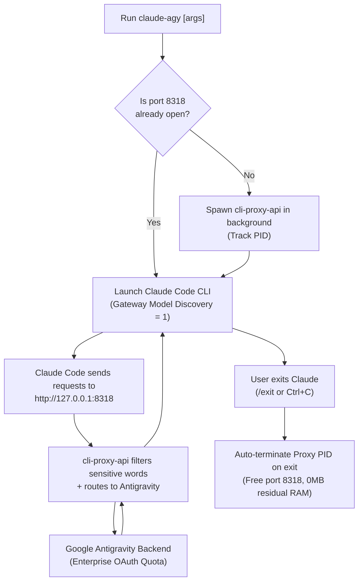

# 🚀 Claude-Agy (`claude-agy`)

> Run Anthropic's **Claude Code CLI** powered by **Google Antigravity OAuth** quotas with zero API token cost, on-demand proxy lifecycle management, and dynamic model discovery.

[](LICENSE)
[](#-installation)
[](#1-windows-via-scoop-recommended)

---

## 🏗️ Architecture & Execution Flow

Claude-Agy wraps Claude Code CLI and coordinates with a background reverse proxy (`CLIProxyAPI`) that dynamically maps requests to Google's Antigravity backend:



---

## ✨ Key Features

- **Zero API Token Cost**: Utilizes your existing Google Antigravity OAuth quota directly.
- **On-Demand Proxy Lifecycle**: Starts the reverse proxy automatically on port `8318` when you run `claude-agy`, and terminates the process when you exit (0 MB RAM overhead when idle).
- **Dynamic Multi-Source Token Scanner**: Automatically discovers and validates OAuth tokens across `~/.gemini/` subdirectories, Antigravity IDE (`jetski-standalone-oauth-token`, `%APPDATA%\Antigravity*`), and OAuth credentials (`oauth_creds.json`). Supports custom paths via CLI flag (`--token-path`), env var (`ANTIGRAVITY_TOKEN_PATH`), or `config/settings.env`.
- **Dynamic Model Discovery (`/model`)**: Query and switch models on the fly (Sonnet 3.7 / 4.6, Opus Thinking, Gemini 3.8 Flash High) without maintaining static alias tables.
- **Root & Sandbox Permission Bypass**: Seamless headless execution (`IS_SANDBOX=1` and automated `.claude.json` trust acceptance) for uninterrupted developer workflows.
- **Strict ASCII & Cross-Platform Invariance**: Pure PowerShell 5.1/7+, Node.js, and Bash implementations with zero Windows-1252 ANSI encoding pitfalls.

---

## 📦 Installation

### 1. Windows via Scoop (Recommended)

If you use [Scoop](https://scoop.sh):

```powershell
# Add Tuquet Scoop Bucket
scoop bucket add tuquet https://github.com/tuquet/tuquet-scoop-bucket

# Install Claude-Agy
scoop install claude-agy
```

*To update anytime:*
```powershell
claude-agy update
# Or via Scoop directly:
scoop update tuquet; scoop update claude-agy
```

---

### 2. Universal Node.js Installer (Windows, macOS, Linux)

Requires Node.js 18+:

```bash
# Run one-line installer
curl -fsSL https://raw.githubusercontent.com/tuquet/claude-agy/main/setup.mjs | node
```

Or from local clone:
```bash
node setup.mjs
```

---

### 3. Windows Direct (PowerShell)

Open PowerShell and run:

```powershell
irm https://raw.githubusercontent.com/tuquet/claude-agy/main/scripts/setup.ps1 | iex
```

---

### 4. Linux / macOS / WSL (Bash)

Open terminal and run:

```bash
curl -fsSL https://raw.githubusercontent.com/tuquet/claude-agy/main/scripts/setup.sh | bash
```

---

## ⚡ Quick Start

Once installed, use the global command:

```powershell
# Launch interactive chat
claude-agy

# Inside chat, switch models dynamically
/model

# Run one-shot prompt
claude-agy -p "Write an async HTTP client in Rust"

# Specify a model explicitly
claude-agy --model claude-opus-4-6-thinking

# Specify a custom token file directly
claude-agy --token-path "C:\path\to\custom-token.json"

# Update Claude-Agy & Claude Code CLI to latest
claude-agy update
```

---

## 🔑 Token Discovery & Configuration

Claude-Agy automatically locates and syncs your Antigravity OAuth credentials using a prioritized 5-tier discovery hierarchy:

1. **CLI Argument (`--token-path` / `-t`)**:
   ```bash
   claude-agy --token-path /custom/path/oauth_token.json
   ```
2. **Environment Variable (`ANTIGRAVITY_TOKEN_PATH` or `GEMINI_TOKEN_PATH`)**:
   ```powershell
   $env:ANTIGRAVITY_TOKEN_PATH = "C:\Tokens\my-antigravity-token.json"
   claude-agy
   ```
3. **Configuration File (`config/settings.env`)**:
   ```text
   ANTIGRAVITY_TOKEN_PATH="/custom/path/oauth_token.json"
   ```
4. **Standard Candidate Paths**:
   - `~/.gemini/jetski-standalone-oauth-token` (Antigravity IDE)
   - `~/.gemini/oauth_creds.json`
   - `~/.gemini/antigravity-cli/antigravity-oauth-token`
   - `%APPDATA%\Antigravity\oauth_creds.json` / `~/.config/Antigravity/oauth_creds.json`
5. **Dynamic Directory Scanner**:
   - Automatically searches subdirectories of `~/.gemini` (skipping heavy cache, brain, and history directories) and system application data folders for valid OAuth token JSON payloads.

---

## 📁 Directory Structure

```text
├── bin/
│   ├── claude-agy            # Linux / macOS Bash launcher
│   ├── claude-agy.ps1        # Windows PowerShell launcher
│   ├── claude-agy.cmd        # Windows CMD wrapper
│   ├── claude-agy.mjs        # Universal Node.js launcher
│   └── cli-proxy-api         # Native reverse proxy binary
├── config/
│   ├── config.yaml           # Minimalist proxy configuration
│   └── settings.env          # Environment settings (port, model, auto-bypass)
├── data/
│   └── antigravity-auth.json # Synced OAuth credentials
├── logs/
│   └── proxy.log             # Proxy logs
├── scripts/
│   ├── setup.mjs             # Universal Node.js setup orchestrator
│   ├── setup.ps1             # Windows PowerShell setup orchestrator
│   ├── setup.sh              # Linux / macOS setup orchestrator
│   ├── sync-token.mjs        # Node.js token scanner
│   ├── sync-token.ps1        # PowerShell token scanner
│   ├── sync-token.py         # Python token scanner
│   ├── uninstall.ps1         # Windows uninstaller
│   └── uninstall.sh          # Linux / macOS uninstaller
├── package.json
└── README.md
```

---

## 🗑️ Uninstallation

### Windows (Scoop)
```powershell
scoop uninstall claude-agy
```

### Windows (Direct)
```powershell
& "$env:USERPROFILE\claude-agy\uninstall.ps1"
```

### Linux / macOS
```bash
~/claude-agy/uninstall.sh
```

---

## 📜 License

This project is licensed under the [MIT License](LICENSE).
