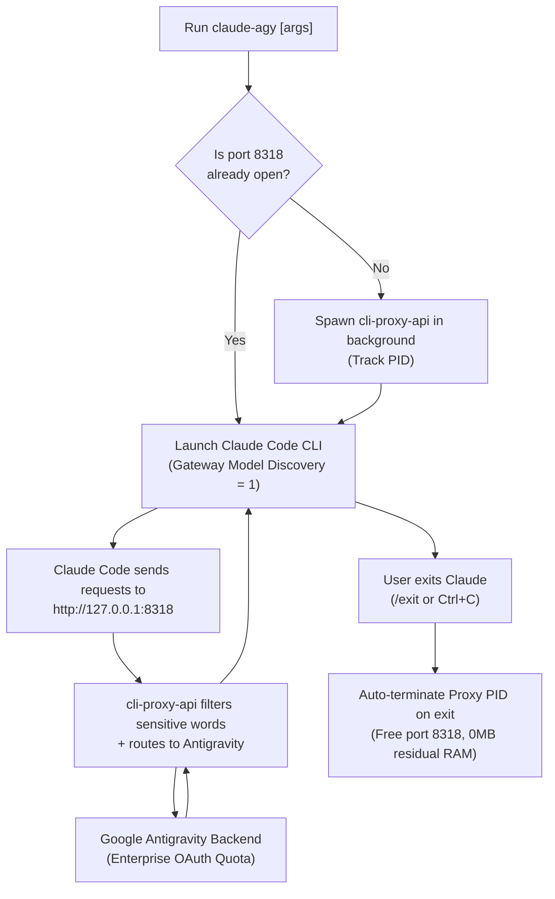

<div align="center">
  
  <h1>Claude-Agy</h1>
  <p><strong>Anthropic Claude Code CLI powered by Google Antigravity Enterprise Quota</strong></p>

  <p>
    <a href="https://github.com/tuquet/scoop-bucket"></a>
    <a href="LICENSE"></a>
  </p>
</div>

---

> Run Anthropic's **Claude Code CLI** powered by **Google Antigravity OAuth** quotas with zero API token cost, on-demand proxy lifecycle management, and dynamic model discovery.

## 🏗️ Architecture & Execution Flow

Claude-Agy wraps Claude Code CLI and coordinates with a background reverse proxy (`CLIProxyAPI`) that dynamically maps requests to Google's Antigravity backend:


```mermaid
flowchart TD
    A["Run claude-agy [args]"] --> B{"Is port 8318<br/>already open?"}
    B -- "No" --> C["Spawn cli-proxy-api in background<br/>(Track PID)"]
    B -- "Yes" --> D["Launch Claude Code CLI<br/>(Gateway Model Discovery = 1)"]
    C --> D
    D --> E["Claude Code sends requests to<br/>http://127.0.0.1:8318"]
    E --> F["cli-proxy-api filters sensitive words<br/>+ routes to Antigravity"]
    F --> G["Google Antigravity Backend<br/>(Enterprise OAuth Quota)"]
    G --> F
    F --> D
    D --> H["User exits Claude<br/>(/exit or Ctrl+C)"]
    H --> I["Auto-terminate Proxy PID on exit<br/>(Free port 8318, 0MB residual RAM)"]
```

---

## ✨ Key Features

- **Zero API Token Cost**: Utilizes your existing Google Antigravity OAuth quota directly.
- **On-Demand Proxy Lifecycle**: Starts the reverse proxy automatically on port `8318` when you run `claude-agy`, and terminates the process when you exit (0 MB RAM overhead when idle).
- **Dynamic Multi-Source Token Scanner**: Automatically discovers and validates OAuth tokens across `~/.gemini/` subdirectories, Antigravity IDE (`jetski-standalone-oauth-token`), and OAuth credentials (`oauth_creds.json`). Supports custom paths via CLI flag (`--token-path`), env var (`ANTIGRAVITY_TOKEN_PATH`), or `config/settings.env`.
- **Dynamic Model Discovery (`/model`)**: Query and switch models on the fly (Sonnet 3.7 / 4.6, Opus Thinking, Gemini 3.8 Flash High) without maintaining static alias tables.
- **Root & Sandbox Permission Bypass**: Seamless headless execution (`IS_SANDBOX=1` and automated `.claude.json` trust acceptance) for uninterrupted developer workflows.
- **Universal Node.js Runtime**: Single cross-platform installer, token scanner, and lifecycle manager with zero operating system fragmentation.

---

## 📦 Installation

### 1. Package Manager (Scoop)

```console
# Add Tuquet Scoop Bucket
scoop bucket add tuquet https://github.com/tuquet/scoop-bucket

# Install Claude-Agy
scoop install claude-agy
```

*To update anytime:*
```console
claude-agy update
# Or via Scoop directly:
scoop update tuquet; scoop update claude-agy
```

---

### 2. Universal Installer (Node.js 18+)

Run the one-line universal installer:

```console
curl -fsSL https://raw.githubusercontent.com/tuquet/claude-agy/main/scripts/setup.mjs | node
```

Or from a local clone:
```console
node scripts/setup.mjs
```

---

## ⚡ Quick Start

Once installed, use the global command:

```console
# Launch interactive chat
claude-agy

# Inside chat, switch models dynamically
/model

# Run one-shot prompt
claude-agy -p "Write an async HTTP client in Rust"

# Specify a model explicitly
claude-agy --model claude-opus-4-6-thinking

# Specify a custom token file directly
claude-agy --token-path "/path/to/custom-token.json"

# Update Claude-Agy & Claude Code CLI to latest
claude-agy update
```

---

## 🔑 Token Discovery & Configuration

Claude-Agy automatically locates and syncs your Antigravity OAuth credentials using a prioritized discovery hierarchy:

1. **CLI Argument (`--token-path` / `-t`)**:
   ```console
   claude-agy --token-path /custom/path/oauth_token.json
   ```
2. **Environment Variable (`ANTIGRAVITY_TOKEN_PATH` or `GEMINI_TOKEN_PATH`)**:
   ```console
   export ANTIGRAVITY_TOKEN_PATH="/custom/path/oauth_token.json"
   claude-agy
   ```
3. **Configuration File (`config/settings.env`)**:
   ```text
   ANTIGRAVITY_TOKEN_PATH="/custom/path/oauth_token.json"
   ```
4. **Standard Candidate Paths**:
   - `~/.gemini/jetski-standalone-oauth-token` (Antigravity IDE)
   - `~/.gemini/oauth_creds.json`
   - `~/.gemini/antigravity-cli/antigravity-oauth-token`
5. **Dynamic Directory Scanner**:
   - Automatically searches subdirectories of `~/.gemini` (skipping heavy cache, brain, and history directories) and system application data folders for valid OAuth token JSON payloads.

---

## 📁 Directory Structure

Claude-Agy employs a portable, cross-platform directory architecture supporting both Windows Scoop installations (`~/scoop/apps/claude-agy/current/` or `%USERPROFILE%\scoop\apps\claude-agy\current\`) and Linux/macOS deployments (`~/.specter/claude-agy/` or `~/claude-agy/`):

```text
claude-agy/  # (Windows Scoop: ~/scoop/apps/claude-agy/current/ | Linux/macOS: ~/.specter/claude-agy/ or ~/claude-agy/)
├── bin/
│   ├── claude-agy            # Universal CLI entrypoint & proxy lifecycle supervisor (cmd/ps1/sh)
│   └── cli-proxy-api         # Native reverse proxy binary (cli-proxy-api.exe on Windows)
├── config/
│   ├── config.yaml           # Proxy routing configuration
│   └── settings.env          # Environment settings (port, model, auto-bypass)
├── data/
│   └── antigravity-auth.json # Synced OAuth credentials
├── logs/                     # Runtime logs (ignored in VCS)
├── scripts/
│   ├── setup.mjs             # Universal Node.js installer
│   ├── sync-token.mjs        # Universal Node.js token scanner & synchronizer
│   └── uninstall.mjs         # Universal Node.js uninstaller
├── install.sh                # Standard local installer wrapper (POSIX)
├── uninstall.sh              # Standard local uninstaller wrapper (POSIX)
└── README.md
```

---

## 🗑️ Uninstallation

Via package manager (Windows Scoop):
```console
scoop uninstall claude-agy
```

Via universal script (Linux/macOS or local clone):
```console
# Linux/macOS:
node ~/.specter/claude-agy/scripts/uninstall.mjs
# Or to clean up all configuration and cache:
node ~/.specter/claude-agy/scripts/uninstall.mjs --all

# Or from local repository clone:
node scripts/uninstall.mjs --all
```

---

## 🌐 Ecosystem

Part of the **Automation & Agent Ecosystem**:

- [Automa](https://github.com/tuquet/automa) — Next-generation browser automation engine & Web Studio.
- [Runner](https://github.com/tuquet/runner) — Universal distributed process supervision engine in Rust.
- [Browser](https://github.com/tuquet/browser) — High-performance isolated Chromium sandbox & stealth automation core.
- [Cloud](https://github.com/tuquet/cloud) — Enterprise cloud orchestration & real-time telemetry control plane.
- [CLI](https://github.com/tuquet/cli) — Developer ergonomic master CLI, interactive REPL & native MCP server.
- [Lib](https://github.com/tuquet/lib) — Monorepo for shared enterprise UI & utilities (`vue-ui`, `vue-table`, `md-export`, `extension-runner`, `lunar`).
- [Scoop Bucket](https://github.com/tuquet/scoop-bucket) — Official Scoop distribution channel for Tuquet software.

---

## 📜 License

This project is licensed under the [MIT License](LICENSE).

---

<div align="center">
  <samp>
    <a href="https://tuquet.github.io">Portfolio</a> •
    <a href="https://tuquet.github.io/cv">CV &amp; Resume</a> •
    <a href="https://tuquet.github.io/automa">Automa Studio</a> •
    <a href="https://tuquet.github.io/lib">Component Lab</a> •
    <a href="https://github.com/tuquet/scoop-bucket">Scoop Bucket</a>
  </samp>
</div>
